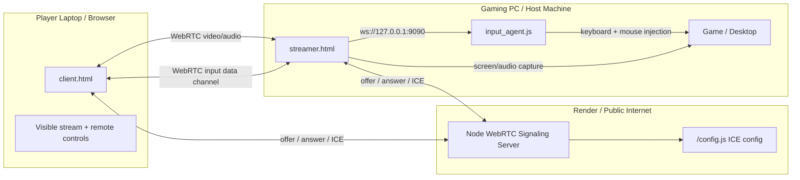
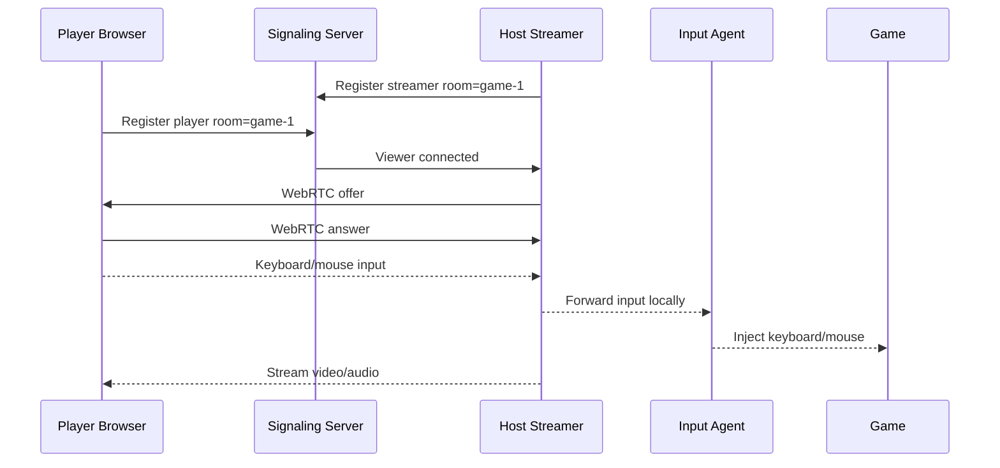
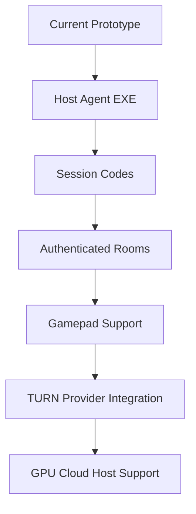

<p align="center">
  
</p>

<h1 align="center">Pixulse Cloud</h1>

<p align="center">
  <strong>Interactive browser game streaming powered by WebRTC, Django, Node.js, and a host-side input agent.</strong>
</p>

<p align="center">
  <a href="#quick-start">Quick Start</a>
  |
  <a href="#architecture">Architecture</a>
  |
  <a href="#deploy-on-render">Deploy</a>
  |
  <a href="#roadmap">Roadmap</a>
</p>

<p align="center">
  
  
  
  
</p>

<p align="center">
  
  
  
  
</p>

---

<table>
  <tr>
    <td width="55%">
      <h2>Play From A Browser. Render On A Gaming PC.</h2>
      <p>
        Pixulse Cloud streams a game from a host machine to a browser and sends player input back in real time.
        The player side stays lightweight. The host side does the heavy lifting.
      </p>
      <p>
        This repository combines a Django game portal, a WebRTC signaling service, a browser streamer, a browser player,
        and a local input agent for keyboard/mouse control.
      </p>
    </td>
    <td width="45%">
      <table>
        <tr><td><strong>Video</strong></td><td>WebRTC media stream</td></tr>
        <tr><td><strong>Input</strong></td><td>WebRTC data channel</td></tr>
        <tr><td><strong>Catalog</strong></td><td>Django game pages</td></tr>
        <tr><td><strong>Pairing</strong></td><td>Room URLs</td></tr>
        <tr><td><strong>Host Control</strong></td><td>Local input agent</td></tr>
      </table>
    </td>
  </tr>
</table>

---

## Product Snapshot

<table>
  <tr>
    <td align="center" width="25%">
      <h3>Game Portal</h3>
      <p>Django-powered catalog, game detail pages, admin panel, images, genres, and launch entry points.</p>
    </td>
    <td align="center" width="25%">
      <h3>Live Stream</h3>
      <p>Host PC shares screen/audio through WebRTC for low-latency browser playback.</p>
    </td>
    <td align="center" width="25%">
      <h3>Remote Input</h3>
      <p>Mouse, clicks, wheel, and keyboard are sent to the host through a data channel.</p>
    </td>
    <td align="center" width="25%">
      <h3>Cloud Ready</h3>
      <p>Node signaling service can run on Render while the input agent stays on the gaming machine.</p>
    </td>
  </tr>
</table>

---

## Architecture



### Runtime Rule

```text
client.html      -> opens on the player's laptop
streamer.html    -> opens on the gaming PC
input_agent.js   -> runs on the gaming PC
signaling server -> runs publicly, for example on Render
```

---

## Experience Flow



---

## Features

| Category | Capability |
| --- | --- |
| Streaming | Real-time WebRTC screen/audio stream |
| Input | Keyboard, mouse move, click, right click, wheel |
| Pairing | Room-based URLs such as `?room=game-1` |
| Web portal | Django home page, game pages, login/admin |
| Admin | Game and genre management |
| Deployment | Render-ready Django service and Node signaling service |
| Networking | STUN by default, TURN-ready for production |
| Calibration | URL-based pointer offset tuning |

---

## Tech Stack

<table>
  <tr>
    <td><strong>Frontend</strong></td>
    <td>HTML, CSS, JavaScript, WebRTC APIs</td>
  </tr>
  <tr>
    <td><strong>Portal Backend</strong></td>
    <td>Django, Gunicorn, WhiteNoise</td>
  </tr>
  <tr>
    <td><strong>Signaling</strong></td>
    <td>Node.js, Express, ws</td>
  </tr>
  <tr>
    <td><strong>Host Input</strong></td>
    <td>@nut-tree-fork/nut-js</td>
  </tr>
  <tr>
    <td><strong>Deployment</strong></td>
    <td>Render web services</td>
  </tr>
</table>

---

## Project Structure

```text
Pixulse-Cloud/
  ak/
    manage.py
    ak/
      settings.py
      urls.py
    pcloud/
      models.py
      views.py
      admin.py
    templates/
      home.html
      gamepage.html
    assets/
    staticfiles/

  webrtc_gamestreaming/
    server/
      signaling_server.js
      input_agent.js
    public/
      client.html
      streamer.html
      client.js
      style.css
    package.json

  render.yaml
  requirements.txt
```

---

## Quick Start

### 1. Install Django dependencies

```powershell
cd "D:\New folder\Pixulse-Cloud"
python -m venv .venv
.\.venv\Scripts\Activate.ps1
python -m pip install --upgrade pip
python -m pip install -r requirements.txt
```

If PowerShell blocks activation:

```powershell
Set-ExecutionPolicy -Scope CurrentUser RemoteSigned
.\.venv\Scripts\Activate.ps1
```

### 2. Start the Django portal

```powershell
cd "D:\New folder\Pixulse-Cloud\ak"
python manage.py migrate
python manage.py runserver
```

Open:

```text
http://127.0.0.1:8000/
```

Create an admin user:

```powershell
python manage.py createsuperuser
```

Admin panel:

```text
http://127.0.0.1:8000/admin/
```

### 3. Start the host input agent

Run this on the gaming PC:

```powershell
cd "D:\New folder\Pixulse-Cloud\webrtc_gamestreaming"
npm install
npm run input-agent
```

Expected output:

```text
Pixulse input agent listening on ws://127.0.0.1:9090
```

### 4. Start local signaling

```powershell
cd "D:\New folder\Pixulse-Cloud\webrtc_gamestreaming"
npm start
```

Open streamer on the gaming PC:

```text
http://localhost:8080/streamer.html?room=game-1
```

Open player on another browser or laptop:

```text
http://localhost:8080/client.html?room=game-1
```

The `room` value must match.

---

## Deployed Demo Flow

### Host / Gaming PC

Run the local input agent:

```powershell
cd "D:\New folder\Pixulse-Cloud\webrtc_gamestreaming"
npm run input-agent
```

Open:

```text
https://your-signaling-service.onrender.com/streamer.html?room=game-1
```

Click `Start Streaming`, then share the entire screen or game window.

### Player Laptop

Open:

```text
https://your-signaling-service.onrender.com/client.html?room=game-1
```

Click inside the stream to begin sending mouse and keyboard input.

---

## Deploy On Render

Pixulse Cloud uses two public services:

```text
Django Web Portal    -> Python web service
WebRTC Signaling     -> Node web service
```

### Django service

Recommended Render values:

```text
Root Directory: .
Build Command: cd ak && pip install -r ../requirements.txt && python manage.py migrate --noinput && python manage.py collectstatic --noinput
Start Command: gunicorn -w 2 -b 0.0.0.0:$PORT ak.wsgi:application --chdir=ak
```

Add this environment variable after the signaling service is live:

```text
WEBRTC_PUBLIC_URL=https://your-signaling-service.onrender.com
```

### Signaling service

Create a separate Render Web Service:

```text
Name: pixulse-signaling
Runtime: Node
Root Directory: webrtc_gamestreaming
Build Command: npm install
Start Command: npm start
```

The signaling service serves:

```text
/client.html
/streamer.html
/config.js
```

---

## Mouse Calibration

If the streamed pointer and click point feel slightly offset, tune the player URL:

```text
https://your-signaling-service.onrender.com/client.html?room=game-1&pointerOffsetY=-18
```

Examples:

```text
pointerOffsetY=-10   less upward shift
pointerOffsetY=-25   more upward shift
pointerOffsetX=10    shift right
pointerOffsetX=-10   shift left
```

---

## Production Reality Check

This is an interactive game-streaming prototype. It proves the core loop:

```text
stream video -> send input -> control host game
```

Before commercial production, add:

- A reliable TURN provider.
- Authenticated rooms and session codes.
- Packaged host agent installer.
- Game launch automation.
- Gamepad support.
- Connection metrics and health checks.
- Billing, queues, and session lifecycle management.
- GPU cloud hosts for true no-host-PC cloud gaming.

---

## Roadmap



Planned upgrades:

- Package the input agent as a Windows executable.
- Add TeamViewer-style session codes.
- Add authenticated streamer/player rooms.
- Add automatic game launch on the host machine.
- Add gamepad input through the WebRTC data channel.
- Add TURN provider integration.
- Add latency, bitrate, packet loss, and connection-state dashboards.
- Add GPU VM orchestration for real cloud gaming sessions.

---

## Command Center

```powershell
# Django portal
cd "D:\New folder\Pixulse-Cloud"
.\.venv\Scripts\Activate.ps1
cd ak
python manage.py runserver

# Host input agent
cd "D:\New folder\Pixulse-Cloud\webrtc_gamestreaming"
npm run input-agent

# Local signaling server
cd "D:\New folder\Pixulse-Cloud\webrtc_gamestreaming"
npm start
```

---

<p align="center">
  <strong>Pixulse Cloud turns a gaming PC into a browser-playable streaming machine.</strong>
</p>

<p align="center">
  Built for experimentation, demos, and the next step toward full cloud gaming infrastructure.
</p>
